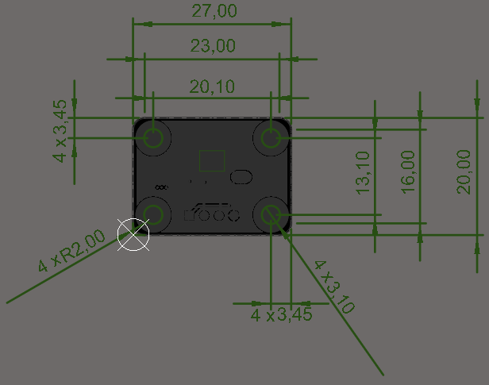
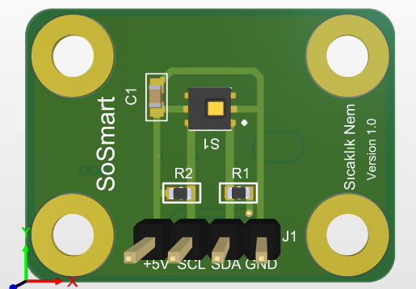
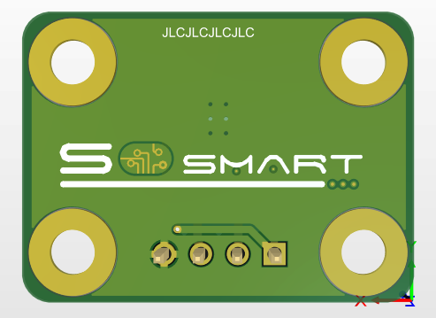
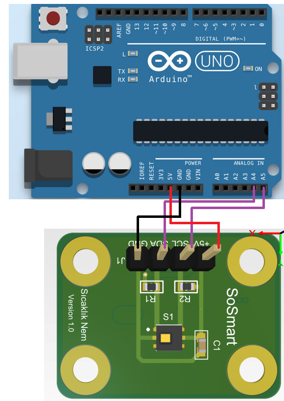
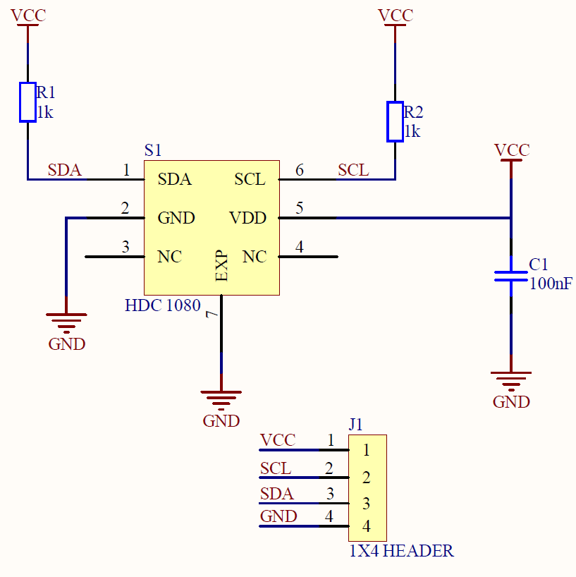

#  Sıcaklık-Nem Sensör Kartı

### 1. KAPSAM
 
 Bu döküman Sıcaklık-Nem Sensör Kart'ının tanımını ve çalışma prensibini açıklar.
 
 ### 2. ÜRÜN PARAMETRELERİ
 
 - 1 Çalışma Gerilimi: Vmin=2.7V Vmax=5.5V DC
 - 2 Çalışma Sıcaklığı: -65 ~ +150 °C 
 - 3 Bağıl Nem Doğruluğu: +- %2
 - 4 Sıcaklık Doğruluğu: -+%2
 - 5 Ölçüm Çözünürlüğü: 14 bit
 
 ### 3. MEKANİK
 
 
 
 
 
 Pdf [Temperature-Humidity-Sensor](Mechanic/Temperature-Humidity-Sensor.pdf)
 
 ### 4. PİN AÇIKLAMALARI
 |Pin Adı|Açıklama|
 |------|------|
 |+5V|DC +5V besleme pimi|
 |SCL|I^2C haberleşmesi için seri Clock hattı|
 |SDA|I^2C haberleşmesi için seri Data hattı|
 |GND|Toprak bağlantı pimi|
 
 ### 5. Arduino Bağlantısı
 
 
 
 ### 6. Devre
 

Data Sheet [hdc1080](Circuit/hdc1080.pdf)

Sch File [Temperature-Humidity-Sensor](Circuit/Temperature-Humidity-Sensor.pdf) 

Bom List [Temperature-Humidity-Sensor_BomList](Circuit/Motor_Driver_1.6_Black.zip)
 
Gerber File [Gerber](Circuit/Temperature-Humidity-Sensor_1.6.zip) 
 
 ### GENEL BAKIŞ 
 Sıcaklık-Nem Sensör Kartı ortamın sıcaklığını ve nemini ölçmek amacıyla tasarlanmıştır.Prototiplemeye imkan sağlaması, arduino ve çeşitli devrelerde rahatça kullanılabilmesi için gerekli pinler devre kartı sayesinde dışarıya alınmıştır.Standart pin yapısı sayesinde rahatça kontrol edilebilir. Jumper kablolar ile bağlantıları yapılabilir. Sensör olarak HDC1080 kullanılmıştır.Detaylı bilgi için linkler incelenebilir.
 
[Temperature-Humidity](ArduionoExample/Sicaklik_Nem/Sicaklik_Nem.ino)
